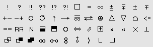
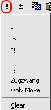
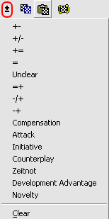

# Research about NAGs

## PGN Specification

Why is research here necessary? The [section 8.2.4](/pgn-specification.md#824-movetext-nag-numeric-annotation-glyph)
is very short, and just tells us that only 255 NAGs are possible `$0` is not allowed.

> An NAG (Numeric Annotation Glyph) is a movetext element that is used to indicate a simple annotation in a language independent manner.
> An NAG is formed from a dollar sign ("$") with a non-negative decimal integer suffix.
> The non-negative integer must be from zero to 255 in value.

The [section 10](/pgn-specification.md#10-numeric-annotation-glyphs) is more informative, but interestingly, the real
symbols used are not (all) included there. A typical part looks like

> | NAG  | Interpretation |
> |-----:| ---------------------|
> | 0    |  null annotation|
> | 1    |  good move (traditional "!")|
> | 2    |  poor move (traditional "?")|
> | 40   |  White has the attack|
> | 41   |  Black has the attack|
> | 42   |  White has insufficient compensation for material deficit|
>  43   |  Black has insufficient compensation for material deficit|

So the graphical symbols used (here for `$1` == `"!"`) are only shown in the interpretation.

> NAG zero is used for a null annotation; it is provided for the convenience of software designers as a placeholder value and should probably not be used in external PGN data.
> 
> NAGs with values from 1 to 9 annotate the move just played.
> 
> NAGs with values from 10 to 135 modify the current position.
> 
> NAGs with values from 136 to 139 describe time pressure.
> 
> Other NAG values are reserved for future definition.

## Other Resources

### Wikipedia Article

The [wikipedia article](https://en.wikipedia.org/wiki/Numeric_Annotation_Glyphs) is here much more informative. The following are relevant parts:

* The [Standard NAGs section](https://en.wikipedia.org/wiki/Numeric_Annotation_Glyphs#Standard_NAGs) includes besides the number and meaning symbol, Unicode, HTML entities, and the name.
* The [Non Standard NAGs section](https://en.wikipedia.org/wiki/Numeric_Annotation_Glyphs#Standard_NAGs) includes a column that references the tools that uses that annotation.

There is some mentioning of `CA Chess Font` which can be downloaded for free from various sites. 

### Other Sources

By following the wikipedia article, you will find some more resources, some of them in the archives of the internet. I don't think that many of them are useful in defining the NAGs (in an appropriate way), but maybe some of them will be helpful to understand what was done before.

#### ChessTempo Article

The [ChessTempo Article](https://old.chesstempo.com/chess-forum/general_chess_discussion/pgn_nag_symbols-t4991.0.html) was the best I could find up to now.

The article includes a back reference to the Wikipedia article (which seems to be the de facto reference for the definition of NAGs).

#### Chess Informant: Systems of Signs

The [archive page](https://web.archive.org/web/20170101061157/http://www.chessinformant.org/pages.php?pageid=15) contains some interesting additional symbols that are not included in the wikipedia table. So perhaps it would be a good idea, to adapt them.

The font used there is named `FigurineCB AriesSP` which I could download [here](https://en.m.fontke.com/font/20449880/download/#google_vignette). The interesting fact is the following:

> Copyright (C) 1991-98 SoftPlus, Sofia, BULGARIA. All Rights Reserved.
Licensed to the ChessBase GmbH Hamburg.

Those signs are a subset of the ones of the wikipedia page, with some exceptions.

* with compensation for the material: &#10867;
* greater board room: &#9675;
* with counter-play: &#8646;
* better is: &#8979;
* file
* diagonal
* centre
* king's side
* queen's side
* weak point
* pair of bishops
* bishops of opposite color
* bishops of same color
* united pawns
* double pawns
* passed pawns
* time
* with
* without
* etc
* see

Some of them are really strange, and I don't know how I would use them as NAG for a move (with, without, etc, see??), but some may be useful for annotations.

### ChessPad

ChessPad was referenced in the Wikipedia article, so I installed the current version 2.0.9 to do some research in it. 

I took the following screenshots of some dialogs.

  

## Synthesis of all known NAGs

The following table takes the Wikipedia article, and adds some resources. This is how to read it:

* NAG: Number used
* Meaning: The known meaning of the NAG, mostly taken from Wikipedia article
* Symbol: The symbol (as unicode character or for CA Chess Fonts as image)
* Unicode: in Hex format
* CA Font: x or unicode
* Lichess: Used and available in Lichess (see remarks below about special usage by Lichess)
* Chesspad: Used and available in Chesspad
* Chessbase: Used and available in Chessbase

| NAG     | Meaning                                                         | Symbol      | Unicode (Hex) | CA Font | Lichess | Chesspad | Chessbase |
|---------|-----------------------------------------------------------------|-------------|---------------|---------|---------|----------|-----------|
| 0       | null annotation                                                 |             |               |         |         |          |           |
| 1       | good move                                                       | !           | U+0021        |         |         |          |           |
| 2       | poor move or mistake                                            | ?           | U+003F        |         |         |          |           |
| 3       | very good or brilliant move                                     | ‼           | U+203C        |         |         |          |           |
| 4       | very poor move or blunder                                       | ⁇           | U+2047        |         |         |          |           |
| 5       | speculative or interesting move                                 | ⁉	       | U+2049        |         |         |          |           |
| 6       | questionable or dubious move                                    | ⁈           | U+2048        |         |         |          |           |
| 7       | forced move (all others lose quickly) or only move              | □           | U+25A1        |         |         |          |           |
| 8       | singular move (no reasonable alternatives)                      |             |               |         |         |          |           |
| 9       | worst move                                                      |             |               |         |         |          |           |
| 10      | drawish position or even                                        | =           | U+003D        |         |         |          |           |
| 11      | equal chances, quiet position                                   |             |               |         |         |          |           |
| 12      | equal chances, active position                                  |             |               |         |         |          |           |
| 13      | unclear position                                                | ∞           | U+221E        |         |         |          |           |
| 14      | White has a slight advantage                                    | ⩲           | U+2A72        |         |         |          |           |
| 15      | Black has a slight advantage                                    | ⩱           | U+2A71        |         |         |          |           |
| 16      | White has a moderate advantage                                  | ±           | U+00B1        |         |         |          |           |
| 17      | Black has a moderate advantage                                  | ∓           | U+2213        |         |         |          |           |
| 18      | White has a decisive advantage	                                 | + −         | U+002B U+002D |         |         |          |           |
| 19      | Black has a decisive advantage			                               | − +         | U+002D U+002B |         |         |          |           |
| 20      | White has a crushing advantage (Black should resign)	           |             |               |         |         |          |           |
| 21      | Black has a crushing advantage (White should resign)		          |             |               |         |         |          |           |
| 22      | White is in zugzwang			                                         | ⨀           | U+2A00        |         |         |          |           |
| 23      | Black is in zugzwang                                            | ⨀           | U+2A00        |         |         |          |           |
| 24      | White has a slight space advantage	                             |             |               |         |         |          |           |
| 25      | Black has a slight space advantage	                             |             |               |         |         |          |           |
| 26      | White has a moderate space advantage			                         | ○           | U+25CB        |         |         |          |           |
| 27      | Black has a moderate space advantage                            | ○           | U+25CB        |         |         |          |           |
| 28      | White has a decisive space advantage                            |             |               |         |         |          |           |
| 29      | Black has a decisive space advantage	                           |             |               |         |         |          |           |
| 30      | White has a slight time (development) advantage	                |             |               |         |         |          |           |
| 31      | Black has a slight time (development) advantage	                |             |               |         |         |          |           |
| 32      | White has a moderate time (development) advantage			            | ⟳	          | U+27F3        |         |         |          |           |
| 33      | Black has a moderate time (development) advantage               | ⟳           | 	U+27F3       |         |         |          |           |
| 34      | White has a decisive time (development) advantage	              |             |               |         |         |          |           |
| 35      | Black has a decisive time (development) advantage	              |             |               |         |         |          |           |
| 36      | White has the initiative		                                      | ↑           | 	U+2191       |         |         |          |           |
| 37      | Black has the initiative                                        |             |               |         |         |          |           |
| 38      | White has a lasting initiative	                                 |             |               |         |         |          |           |
| 39      | Black has a lasting initiative	                                 |             |               |         |         |          |           |
| 40      | White has the attack			                                         | →           | U+2192        |         |         |          |           |
| 41      | Black has the attack                                            | →           | U+2192        |         |         |          |           |
| 42      | White has insufficient compensation for material deficit	       |             |               |         |         |          |           |
| 43      | Black has insufficient compensation for material deficit	       |             |               |         |         |          |           |
| 44      | White has sufficient compensation for material deficit	         |             |               |         |         |          |           |
| 45      | Black has sufficient compensation for material deficit		        | =/∞         |               | x       |         |          |           |
| 46      | White has more than adequate compensation for material deficit  |             |               |         |         |          |           |
| 47      | Black has more than adequate compensation for material deficit	 |             |               |         |         |          |           |
| 48      | White has a slight center control advantage	                    |             |               |         |         |          |           |
| 49      | Black has a slight center control advantage	                    |             |               |         |         |          |           |
| 50      | White has a moderate center control advantage	                  |             |               |         |         |          |           |
| 51      | Black has a moderate center control advantage	                  |             |               |         |         |          |           |
| 52      | White has a decisive center control advantage	                  |             |               |         |         |          |           |
| 53      | Black has a decisive center control advantage	                  |             |               |         |         |          |           |
| 54      | White has a slight kingside control advantage	                  |             |               |         |         |          |           |
| 55      | Black has a slight kingside control advantage	                  |             |               |         |         |          |           |
| 56      | White has a moderate kingside control advantage	                |             |               |         |         |          |           |
| 57      | Black has a moderate kingside control advantage	                |             |               |         |         |          |           |
| 58      | White has a decisive kingside control advantage	                |             |               |         |         |          |           |
| 59      | Black has a decisive kingside control advantage	                |             |               |         |         |          |           |
| 60      | White has a slight queenside control advantage	                 |             |               |         |         |          |           |
| 61      | Black has a slight queenside control advantage	                 |             |               |         |         |          |           |
| 62      | White has a moderate queenside control advantage	               |             |               |         |         |          |           |
| 63      | Black has a moderate queenside control advantage	               |             |               |         |         |          |           |
| 64      | White has a decisive queenside control advantage	               |             |               |         |         |          |           |
| 65      | Black has a decisive queenside control advantage	               |             |               |         |         |          |           |
| 66      | White has a vulnerable first rank	                              |             |               |         |         |          |           |
| 67      | Black has a vulnerable first rank	                              |             |               |         |         |          |           |
| 68      | White has a well protected first rank	                          |             |               |         |         |          |           |
| 69      | Black has a well protected first rank	                          |             |               |         |         |          |           |
| 70      | White has a poorly protected king	                              |             |               |         |         |          |           |
| 71      | Black has a poorly protected king	                              |             |               |         |         |          |           |
| 72      | White has a well protected king	                                |             |               |         |         |          |           |
| 73      | Black has a well protected king	                                |             |               |         |         |          |           |
| 74      | White has a poorly placed king	                                 |             |               |         |         |          |           |
| 75      | Black has a poorly placed king	                                 |             |               |         |         |          |           |
| 76      | White has a well placed king	                                   |             |               |         |         |          |           |
| 77      | Black has a well placed king	                                   |             |               |         |         |          |           |
| 78      | White has a very weak pawn structure	                           |             |               |         |         |          |           |
| 79      | Black has a very weak pawn structure	                           |             |               |         |         |          |           |
| 80      | White has a moderately weak pawn structure	                     |             |               |         |         |          |           |
| 81      | Black has a moderately weak pawn structure	                     |             |               |         |         |          |           |
| 82      | White has a moderately strong pawn structure	                   |             |               |         |         |          |           |
| 83      | Black has a moderately strong pawn structure	                   |             |               |         |         |          |           |
| 84      | White has a very strong pawn structure	                         |             |               |         |         |          |           |
| 85      | Black has a very strong pawn structure	                         |             |               |         |         |          |           |
| 86      | White has poor knight placement	                                |             |               |         |         |          |           |
| 87      | Black has poor knight placement	                                |             |               |         |         |          |           |
| 88      | White has good knight placement	                                |             |               |         |         |          |           |
| 89      | Black has good knight placement	                                |             |               |         |         |          |           |
| 90      | White has poor bishop placement	                                |             |               |         |         |          |           |
| 91      | Black has poor bishop placement	                                |             |               |         |         |          |           |
| 92      | White has good bishop placement	                                |             |               |         |         |          |           |
| 93      | Black has good bishop placement	                                |             |               |         |         |          |           |
| 94      | White has poor rook placement	                                  |             |               |         |         |          |           |
| 95      | Black has poor rook placement	                                  |             |               |         |         |          |           |
| 96      | White has good rook placement	                                  |             |               |         |         |          |           |
| 97      | Black has good rook placement	                                  |             |               |         |         |          |           |
| 98      | White has poor queen placement	                                 |             |               |         |         |          |           |
| 99      | Black has poor queen placement	                                 |             |               |         |         |          |           |
| 100     | White has good queen placement	                                 |             |               |         |         |          |           |
| 101     | Black has good queen placement	                                 |             |               |         |         |          |           |
| 102     | White has poor piece coordination	                              |             |               |         |         |          |           |
| 103     | Black has poor piece coordination	                              |             |               |         |         |          |           |
| 104     | White has good piece coordination	                              |             |               |         |         |          |           |
| 105     | Black has good piece coordination	                              |             |               |         |         |          |           |
| 106     | White has played the opening very poorly	                       |             |               |         |         |          |           |
| 107     | Black has played the opening very poorly	                       |             |               |         |         |          |           |
| 108     | White has played the opening poorly	                            |             |               |         |         |          |           |
| 109     | Black has played the opening poorly	                            |             |               |         |         |          |           |
| 110     | White has played the opening well	                              |             |               |         |         |          |           |
| 111     | Black has played the opening well	                              |             |               |         |         |          |           |
| 112     | White has played the opening very well	                         |             |               |         |         |          |           |
| 113     | Black has played the opening very well	                         |             |               |         |         |          |           |
| 114     | White has played the middlegame very poorly	                    |             |               |         |         |          |           |
| 115     | Black has played the middlegame very poorly	                    |             |               |         |         |          |           |
| 116     | White has played the middlegame poorly	                         |             |               |         |         |          |           |
| 117     | Black has played the middlegame poorly	                         |             |               |         |         |          |           |
| 118     | White has played the middlegame well	                           |             |               |         |         |          |           |
| 119     | Black has played the middlegame well	                           |             |               |         |         |          |           |
| 120     | White has played the middlegame very well	                      |             |               |         |         |          |           |
| 121     | Black has played the middlegame very well	                      |             |               |         |         |          |           |
| 122     | White has played the ending very poorly	                        |             |               |         |         |          |           |
| 123     | Black has played the ending very poorly	                        |             |               |         |         |          |           |
| 124     | White has played the ending poorly	                             |             |               |         |         |          |           |
| 125     | Black has played the ending poorly	                             |             |               |         |         |          |           |
| 126     | White has played the ending well	                               |             |               |         |         |          |           |
| 127     | Black has played the ending well	                               |             |               |         |         |          |           |
| 128     | White has played the ending very well	                          |             |               |         |         |          |           |
| 129     | Black has played the ending very well	                          |             |               |         |         |          |           |
| 130     | White has slight counterplay	                                   |             |               |         |         |          |           |
| 131     | Black has slight counterplay	                                   |             |               |         |         |          |           |
| 132     | White has moderate counterplay			                               | ⇆           | U+21C6        |         |         |          |           |
| 133     | Black has moderate counterplay                                  | ⇆           | U+21C6        |         |         |          |           |
| 134     | White has decisive counterplay	                                 |             |               |         |         |          |           |
| 135     | Black has decisive counterplay	                                 |             |               |         |         |          |           |
| 136     | White has moderate time control pressure	                       |             |               |         |         |          |           |
| 137     | Black has moderate time control pressure	                       |             |               |         |         |          |           |
| 138     | White has severe time control pressure / zeitnot			             | ⨁           | U+2A01        |         |         |          |           |
| 139     | Black has severe time control pressure / zeitnot                | ⨁           | U+2A01        |         |         | x        |           |
| 140     | With the idea...		                                              | ∆           |               |         |         | x        |           |
| 141     | Aimed against...		                                              | ∇           |               |         |         | x        |           |
| 142     | Better is...			                                                 | ⌓           | U+2313        |         |         | x        |           |
| 143     | Worse is...			                                                  | <=          |               |         |         | x        |           |
| 144     | Equivalent is...		                                              | ==          |               |         |         | x        |           |
| 145     | Editorial comment		                                             | RR          |               |         |         | x        |           |
| 146-219 | Not defined                                                     |             |               |         |         |          |           |
| 220     | Diagram                                                         | ⬒ (UI only) |               |         |         | x        |           |
| 221     | Diagram                                                         | ⬓ (UI only) |               |         |         | x        |           |
| 222-237 | Not defined                                                     |             |               |         |         |          |           |
| 238     | Space advantage			                                              | ○           | U+25CB        |         |         | x        |           |
| 239     | File (columns on the chessboard labeled  a-h)                   | ⇔           | U+21D4        |         |         | x        |           |
| 240     | Diagonal			                                                     | ⇗           | U+21D7        |         |         | x        |           |
| 241     | Centre			                                                       | ⊞           | U+229E        |         |         | x        |           |
| 242     | King-side			                                                    | ⟫           | U+27EB        |         |         | x        |           |
| 243     | Queen-side			                                                   | ⟪           | U+27EA        |         |         | x        |           |
| 244     | Weak point			                                                   | ✕           | U+2715        |         |         | x        |           |
| 245     | Ending			                                                       | ⊥           | U+22A5        |         |         | x        |           |
| 246     | Bishop pair	                                                    |             |               |         |         | x        |           |
| 247     | Opposite Bishops	                                               |             |               |         |         | x        |           |
| 248     | Same Bishops	                                                   |             |               |         |         | x        |           |
| 249     | Connected pawns	text                                            |             |               |         |         |          |           |
| 250     | Isolated pawns	text                                             |             |               |         |         |          |           |
| 251     | Doubled pawns	text                                              |             |               |         |         |          |           |
| 252     | Passed pawn	                                                    |             |               |         |         | x        |           |
| 253     | Pawn majority	text                                              |             |               |         |         |          |           |
| 254     | With	                                                           |             |               |         |         | x        |           |
| 255     | Without	                                                        |             |               |         |         | x        |           |
