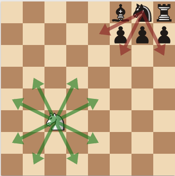
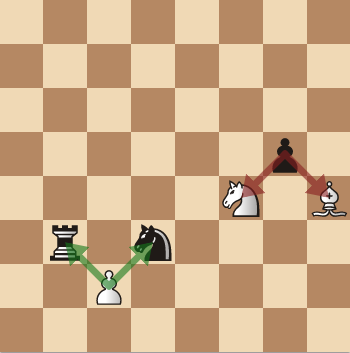

# FIDE Laws of Chess

- [FIDE Laws of Chess](#fide-laws-of-chess)
  - [PREFACE](#preface)
  - [BASIC RULES OF PLAY](#basic-rules-of-play)
    - [Article 1: The nature and objectives of the game of chess](#article-1-the-nature-and-objectives-of-the-game-of-chess)
    - [Article 2: The initial position of the pieces on the chessboard](#article-2-the-initial-position-of-the-pieces-on-the-chessboard)
    - [Article 3: The moves of the pieces](#article-3-the-moves-of-the-pieces)
    - [Article 4: The act of moving the pieces](#article-4-the-act-of-moving-the-pieces)
    - [Article 5: The completion of the game](#article-5-the-completion-of-the-game)
  - [COMPETITION  RULES](#competition--rules)
    - [Article 6: The chess clock](#article-6-the-chess-clock)
    - [Article 7: Irregularities](#article-7-irregularities)
    - [Article 8: The recording of the moves](#article-8-the-recording-of-the-moves)
    - [Article 9: The drawn game](#article-9-the-drawn-game)
    - [Article 10: Quickplay Finish](#article-10-quickplay-finish)
    - [Article 11: Points](#article-11-points)
    - [Article 12: The conduct of the players](#article-12-the-conduct-of-the-players)
    - [Article 13: The role of the Arbiter (See Preface)](#article-13-the-role-of-the-arbiter-see-preface)
    - [Article 14: FIDE](#article-14-fide)
  - [APPENDICES](#appendices)
    - [A. Rapidplay](#a-rapidplay)
    - [B. Blitz](#b-blitz)
    - [C. Algebraic notation](#c-algebraic-notation)
    - [D. Quickplay finishes where no arbiter is present in the venue](#d-quickplay-finishes-where-no-arbiter-is-present-in-the-venue)
    - [E. Rules for play with Blind and Visually Handicapped](#e-rules-for-play-with-blind-and-visually-handicapped)
    - [F. Chess960 Rules](#f-chess960-rules)
    - [G: Guidelines in case a game needs to be adjourned](#g-guidelines-in-case-a-game-needs-to-be-adjourned)

FIDE Laws of Chess cover over-the-board play.
The English text is the authentic version of the Laws of Chess, which was adopted at the 79 ʰ FIDE Congress at Dresden (Germany), November 2008, coming into force on 1 July 2009.
In these Laws the words ‘he’, ‘him’ and ‘his’ include ‘she’ and ‘her’.

Remark: This document was copied over from [FIDE Laws of Chess](https://www.fide.com/FIDE/handbook/LawsOfChess.pdf) on November 22nd 2021.

## PREFACE

The Laws of Chess cannot cover all possible situations that may arise during a game, nor can they regulate all administrative questions. Where cases are not precisely regulated by an Article of the Laws, it should be possible to reach a correct decision by studying analogous situations which are discussed  in the  Laws. The Laws  assume  that arbiters  have the necessary  competence,  sound judgement and absolute objectivity. Too detailed a rule might deprive the arbiter of his freedom of judgement and thus prevent him from finding the solution to a problem dictated by fairness, logic and special factors.

FIDE appeals to all chess players and federations to accept this view.

A member federation is free to introduce more detailed rules provided they:

- do not conflict in any way with the official FIDE Laws of Chess, and
- are limited to the territory of the federation concerned, and
- are not valid for any FIDE match, championship  or qualifying  event, or for a FIDE title or rating tournament.

## BASIC RULES OF PLAY

### Article 1: The nature and objectives of the game of chess

1. The game of chess is played between two opponents who move their pieces alternately on a square board called a ‘chessboard’. The player with the white pieces commences the game. A player is said to ‘have the move’, when his opponent's move has been ‘made’. (See [Article 6.7](#6-7))
2. The objective of each player is to place the opponent's king ‘under attack’ in such a way that the opponent has no legal move. The player who achieves this goal is said to have ‘checkmated’ the opponent's  king and to have won the game. Leaving one's own king under attack, exposing one's own king to attack and also ‘capturing’ the opponent's king are not allowed. The opponent whose king has been checkmated has lost the game.
3. If the position is such that neither player can possibly checkmate, the game is drawn.

### Article 2: The initial position of the pieces on the chessboard

1. The chessboard  is composed of an 8 x 8 grid of 64 equal squares alternately light (the ‘white’ squares) and dark (the ‘black’ squares).  The chessboard is placed between the players in such a way that the near corner square to the right of the player is white.
2. At the beginning of the game one player has 16 light-coloured pieces (the ‘white’ pieces); the other has 16 dark-coloured pieces (the ‘black’ pieces).

These pieces are as follows:

| Piece | Symbol |
|-------|--------|
| A white king | 
| A white queen |  |
| Two white rooks |   |
| Two white bishops |   |
| Two white knights |   |
| Eight white pawns |   |
| A black king |  |
| A black queen |  |
| Two black rooks | |
| Two black bishops | |
| Two black knights | |
| Eight black pawns |  |

1. The initial position of the pieces on the chessboard is as follows

     

2. The  eight  vertical  columns  of  squares  are  called  ‘files’.  The  eight  horizontal rows  of squares are called ‘ranks’. A straight line of squares of the same colour, running from one edge of the board to an adjacent edge, is called a ‘diagonal’.

### Article 3: The moves of the pieces

1. It is not permitted to move a piece to a square occupied by a piece of the same colour.  If a piece moves to a square occupied by an opponent's piece the latter  is captured and removed from the chessboard  as part of the same  move. A piece  is said to attack an opponent's  piece  if the  piece  could  make  a  capture  on that  square  according  to the Articles 3.2 to 3.8. 
A piece is considered to attack a square, even if such a piece is constrained from moving to that square  because  it would then leave or place the king of its own colour under attack.
1. The bishop may move to any square along a diagonal on which it stands.

    
1. The rook may move to any square along the file or the rank on which it stands.

    
1. The queen may move to any square along the file, the rank or a diagonal  on which it stands.

    
1. When making these moves the bishop, rook or queen may not move over any intervening pieces.
1. The knight may move to one of the squares nearest to that on which it stands but not on the same rank, file or diagonal.

    
1. Pawn moves
   1. The pawn may move forward to the unoccupied square immediately in front of it on the same file, or
   2. on its first move the pawn may move as in 3.7.a or alternatively it may advance two squares along the same file provided both squares are unoccupied, or
   3. the  pawn  may  move  to  a  square  occupied  by  an  opponent's  piece,  which  is diagonally in front of it on an adjacent file, capturing that piece.

       
   4. A pawn attacking a square crossed by an opponent's pawn which has advanced two squares in one move from its original square may capture this opponent's pawn as though the latter had been moved only one square. This capture is only legal on the move following this advance and is called an ‘en passant’ capture.

       
   5. When  a  pawn  reaches  the  rank  furthest  from  its  starting  position  it  must  be exchanged as part of the same move on the same square for a new queen, rook, bishop or knight of the same colour. The player's choice is not restricted to pieces that have been captured previously. This exchange of a pawn for another piece is called ‘promotion’ and the effect of the new piece is immediate.

1. King moves
   1. There are two different ways of moving the king:

      by moving to any adjoining square not attacked by one or more of the opponent's pieces

      

      or by ‘castling’. This is a move of the king and either rook of the same colour along the  player's first  rank,  counting  as  a  single  move  of  the  king  and  executed  as follows: the king is transferred  from its original  square two squares towards the rook on its original square, then that rook is transferred to the square the king has just crossed.

      

      Before white kingside castling

      Before black queenside castling

      

      After white kingside castling

      After black queenside cart/ing

      

      Before white queenside castling

      Before black kingside castling

      

      After white queenside castling

      After black kingside castling

   1. The right to castle has been lost:
       1. if the king has already moved, or
       2. with a rook that has already moved.
   1. Castling is prevented temporarily:
       1. if the  square  on  which the  king stands,  or the square  which  it  must cross, or the square which it is to occupy, is attacked by one or more of the opponent's pieces, or
       2. if there is any piece between the king and the rook with which castling is to be effected.
   1. The king is said to be 'in check' if it is attacked by one or more of the opponent's pieces, even if such pieces are constrained from moving to that square because they would then leave or place their own king in check. No piece can be moved that will either expose the king of the same colour to check or leave that king in check.

### Article 4: The act of moving the pieces

1. Each move must be made with one hand only.
1. Provided  that  he first  expresses  his intention (for  example  by  saying „j'adoube“  or “I adjust”), the player having the move may adjust one or more pieces on their squares.
1. Except as provided in [Article 4.2](#4-2), if the player having the move deliberately touches on the chessboard:
   1. one or more of his own pieces, he must move the first piece touched which can be moved
   1. one or  more  of his opponent's  pieces,  he  must  capture  the first  piece touched which can be captured
   1. one piece of each colour, he must capture the opponent's piece with his piece or, if this  is  illegal,  move  or  capture  the  first  piece  touched  which  can  be  moved  or captured. If it is unclear,  whether the player's  own  piece  or his opponent's  was touched first, the  player's  own  piece  shall  be  considered  to have  been touched before his opponent's.
1. If a player having the move:
   1. deliberately touches his king and rook he must castle on that side if it is legal to do so
   1. deliberately touches a rook and then his king he is not allowed to castle on that side on that move and the situation shall be governed by Article 4.3.a
   1. intending to castle, touches the king or king and rook at the same time, but castling on that side is illegal, the player must make another legal move with his king (which may include castling on the other side). If the king has no legal move, the player is free to make any legal move
   1. promotes a pawn, the choice of the piece is finalised, when the piece has touched the square of promotion.
1. If none of the pieces touched can be moved or captured, the player may make any legal move.
1. When, as a legal move or part of a legal move, a piece has been released on a square, it cannot be moved to another square on this move. The move is then considered to have been made:
   1. in the  case  of a capture,  when the  captured  piece  has been  removed  from the chessboard  and the player, having  placed  his own  piece  on its new  square, has released this capturing piece from his hand
   1. in the case of castling, when the player's hand has released the rook on the square previously  crossed  by the king. When the player  has released  the  king from his hand, the move is not yet made, but the player no longer has the right to make any move other than castling on that side, if this is legal
   1. in the case of the promotion of a pawn, when the pawn has been removed from the chessboard and the player's hand has released the new piece after placing it on the promotion  square.  If the player  has released  from  his  hand  the  pawn  that  has reached the promotion square, the move is not yet made, but the player no longer has the right to play the pawn to another square.

    The  move  is  called  legal  when  all  the  relevant  requirements  of  Article  3  have  been fulfilled. If the move is not legal, another move shall be made instead as per Article 4.5.
1. A player forfeits his right to a claim against his opponent's violation of Article 4 once he deliberately touches a piece.

### Article 5: The completion of the game

1. Wins
   1. The game  is  won  by the  player  who  has  checkmated  his  opponent's  king.  This immediately  ends  the  game,  provided  that  the  move  producing  the  checkmate position was a legal move.
   1. The  game  is  won  by  the  player  whose  opponent  declares  he  resigns.  This immediately ends the game.
1. Draws
   1. The game is drawn when the player to move has no legal move and his king is not in check. The game  is said to end  in ‘stalemate’.  This  immediately  ends the game, provided that the move producing the stalemate position was legal.
   1. The  game  is  drawn  when  a  position  has  arisen  in  which  neither  player  can checkmate the opponent's king with any series of legal moves. The game is said to end in a ‘dead position’. This immediately ends the game, provided that the move producing the position was legal.  (See [Article 9.6](#9-6))
   1. The game is drawn upon agreement between the two players during the game. This immediately ends the game. (See [Article 9.1](#9-1))
   1. The game may be drawn if any identical position is about to appear or has appeared on the chessboard at least three times. (See [Article 9.2](#9-2))
   1. The game may be drawn if each player has made at least the last 50 consecutive moves without the movement  of any pawn and without any capture. (See [Article 9.3](#9-3))

## COMPETITION  RULES

### Article 6: The chess clock

1. ‘Chess clock’ means a clock with two time displays, connected to each other in such a way that only one of them can run at one time.  ‘Clock’ in the Laws of Chess, means one of the two time displays. Each time display has a ‘flag’.  ‘Flag fall’ means the expiration of the allotted time for a player.
1. Chess Clock Rules
   1. When using a chess clock, each player must make a minimum number of moves or all  moves  in  an  allotted  period  of time  and/or  may  be  allocated  an  additional amount of time with each move. All these must be specified in advance.
   1. The time saved by a player during one period is added to his time available for the next period, except in the ‘time delay’ mode.
   In the time delay mode both players receive an allotted ‘main thinking time’. Each player also receives  a ‘fixed  extra time’ with every move. The countdown  of the main time only commences  after the fixed time has expired. Provided the player stops his clock before the expiration of the fixed time, the main thinking time does not change, irrespective of the proportion of the fixed time used.
1. Immediately after a flag falls, the requirements of article 6.2 a. must be checked.
1. Before the start of the game the arbiter decides where the chess clock is placed.
1. At the time determined  for the start of the game the clock of the player  who has the white pieces is started.
1. Forfeiting
   1. Any player who arrives at the chessboard after the start of the session shall lose the game. Thus the default time is 0 minutes. The rules of a competition  may specify otherwise.
   1. If the rules  of a  competition  specify  a  different  default time, the following  shall apply. If neither player is present initially, the player who has the white pieces shall lose all the time that elapses until he arrives, unless the rules of the competition specify or the arbiter decides otherwise.
1. Chess Clock Handling
   1. During the game each player, having made his move on the chessboard, shall stop his own clock and start his opponent's  clock. A player must always be allowed to stop his clock.  His move is not considered to have been completed until he has done so, unless the move that was made ends the game. (See the Articles [5.1.a](#5-1-1), [5.2.a](#5-2-1), [5.2.b](#5-2-2), [5.2.c](#5-2-3) and [9.6](#9-6)) The time between making the move on the chessboard and stopping his own clock and starting  his opponent‘s  clock  is regarded  as part  of the time  allotted  to the player.
   2. A player must stop his clock with the same hand as that with which he made his move. It is forbidden for a player to keep his finger on the button or to ‘hover’ over it.
   3. The players must handle the chess clock properly. It is forbidden to punch it forcibly, to pick  it up  or to knock  it  over. Improper  clock  handling  shall  be  penalised  in accordance with [Article 13.4](#13-4).
   4. If a player is unable to use the clock, an assistant, who must be acceptable to the arbiter, may be provided by the player to perform this operation. His clock shall be adjusted by the arbiter in an equitable way.
1. A flag is considered  to have fallen  when the arbiter  observes the fact or when  either player has made a valid claim to that effect.
1. Except where one of the Articles: [5.1.a](#5-1-1), [5.1.b](#5-1-2), [5.2.a](#5-2-1), [5.2.b](#5-2-2), [5.2.c](#5-2-3) applies, if a player does not complete the prescribed number of moves in the allotted time, the game is lost by the player. However, the game is drawn, if the position is such that the opponent cannot checkmate the player's king by any possible series of legal moves.
1. Defective Chess Clocks
   1. Every indication given by the clocks is considered to be conclusive in the absence of any  evident  defect. A chess  clock  with  an  evident  defect  shall  be replaced.  The  arbiter  shall  replace  the clock and use his best judgment  when determining  the times to be  shown on the replacement chess clocks.
   1. If during a game it is found that the setting of either or both clocks was incorrect, either player or the arbiter shall stop the clocks immediately. The arbiter shall install the correct  setting and adjust the times and move counter. He shall use his best judgement when determining the  correct settings.
1. If both flags have fallen and it is impossible to establish which flag fell first then:
   1. the game shall  continue  if it happens  in any period  of the game  except the last period
   2. the game  is drawn  if it happens  in the period of a game, in which all remaining movesmust be completed.
1. Interruption
   1. If the game needs to be interrupted, the arbiter shall stop the clocks.
   2. A player  may  stop the  clocks  only  in  order to seek the  arbiter's  assistance,  for example when promotion has taken place and the piece required is not available.
   3. The arbiter shall decide when the game is to be restarted in either case.
   4. If a player stops the clocks in order to seek the arbiter's assistance, the arbiter shall determine  if the player had any valid reason for doing so. If it is obvious that the player had no valid reason for stopping the clocks, the player shall be penalised according to [Article 13.4](#13-4).
1. If an irregularity occurs and/or the pieces have to be restored to a previous position, the arbiter shall use his best judgement to determine the times to be shown on the clocks. He shall also, if necessary, adjust the clock's move counter.
1. Screens,  monitors,  or  demonstration  boards  showing  the  current  position  on  the chessboard, the moves and the number of moves made, and clocks which also show the number of moves, are allowed in the playing hall. However, the player may not make a claim relying solely on information shown in this manner.

### Article 7: Irregularities

1. Board
   1. If during a game it is found that the initial position of the pieces was incorrect, the game shall be cancelled and a new game played.
   2. If during a game it is found that the chessboard has been placed contrary to [Article 2.1](#2-1), the game continues but the position reached must be transferred to a correctly placed chessboard.
1. If a game has begun with colours reversed then it shall continue, unless the arbiter rules otherwise.
1. If a player displaces one or more pieces, he shall re-establish the correct position on his own time. If necessary, either the player or his opponent shall stop the clocks and ask for the arbiter's assistance. The arbiter may penalise the player who displaced the pieces.
1. Illegal moves
   1. If  during  a  game  it  is found  that  an  illegal  move,  including  failing to meet  the requirements  of the promotion  of a pawn or capturing the opponent's  king, has been   completed,   the  position   immediately   before  the   irregularity   shall   be reinstated. If the position immediately before the irregularity cannot be determined the game shall continue from the last identifiable position prior to the irregularity. The clocks shall be adjusted according to [Article 6.13](#6-13). The Articles [4.3](#4-3) and [4.6](#4-6) apply to the move replacing the illegal move. The game shall then continue from this re- instated position.
   2. After the action taken under [Article 7.4.a](#7-4-1), for the first two illegal moves by a player the arbiter shall give two minutes extra time to his opponent in each instance; for a third illegal move by the same player, the arbiter shall declare the game lost by this player. However, the game is drawn if the position is such that the opponent cannot checkmate the player's king by any possible series of legal moves.
1. If during  a game  it  is found that  pieces  have  been  displaced  from their  squares, the position before the irregularity shall be re-instated. If the position immediately before the irregularity  cannot  be  determined,  the  game  shall  continue  from the  last  identifiable position prior to the irregularity. The clocks shall be adjusted according to [Article 6.13](#6-13). The game shall then continue from this re-instated position.

### Article 8: The recording of the moves

1. In the course of play each player is required to record his own moves and those of his opponent in the correct manner, move after move, as clearly and legibily as possible, in the  algebraic   notation  (See   [Appendix C](#c-algebraic-notation)),  on  the  scoresheet   prescribed   for  the competition.

    It  is  forbidden  to  write  the  moves  in  advance,  unless  the  player  is  claiming  a  draw according  to  Article  [9.2](#9-2),  or [9.3](#9-3)  or  adjourning  a  game  according  to the  Guidelines  of [Adjourned Games point 1.a](#G-1-1).

    A player may reply to his opponent's move before recording it, if he so wishes. He must record his previous move before making another. Both players must record the offer of a draw on the scoresheet. (See [Appendix C.13](#C-13))

    If a player is unable to keep score, an assistant, who must be acceptable to the arbiter, may be provided  by the player to write the moves. His clock shall  be adjusted  by the arbiter in an equitable way.
1. The scoresheet shall be visible to the arbiter throughout the game.
1. The scoresheets are the property of the organisers of the event.
1. If a player has less than five minutes left on his clock at some stage in a period and does not have additional  time of 30 seconds or more  added  with each move, then for the remainder of the  period  he  is  not  obliged  to  meet  the  requirements  of  [Article  8.1](#8-1). Immediately  after one flag has fallen the player must update his scoresheet completely before moving a piece on the chessboard.
1. Not keeping score
   1. If  neither  player  is  required  to  keep  score  under  [Article  8.4](#8-4), the  arbiter  or  an assistant should try to be present  and keep score. In this case, immediately  after one flag has fallen, the arbiter shall stop the clocks. Then both players shall update their scoresheets, using the arbiter's or the opponent's scoresheet.
   1. If only one player is not required to keep score under [Article 8.4](#8-4), he must, as soon as either flag has fallen, update his scoresheet completely before moving a piece on the  chessboard.  Provided  it  is  the  player's  move,  he  may  use  his  opponent's scoresheet, but must return it before making a move.
   1. If no complete scoresheet is available, the players must reconstruct the game on a second chessboard  under the control  of the arbiter or an assistant. He shall first record the actual game position, clock times and the number of moves made, if this information is available, before reconstruction takes place.
1. If the scoresheets  cannot be brought up to date showing that a player has overstepped the allotted time, the next move made shall be considered as the first of the following time period, unless there is evidence that more moves have been made.
1. At the conclusion  of the game both players  shall  sign both scoresheets, indicating the result of the game. Even  if incorrect, this result  shall stand, unless the arbiter decides
otherwise.

### Article 9: The drawn game

1. Defined rules for draw
   1. The  rules  of  a  competition  may  specify  that  players  cannot  agree  to  a  draw, whether in less than a specified number of moves or at all, without the consent of the arbiter.
   2. If the rules of a competition allow a draw agreement the following apply:
      1. A player wishing to offer a draw shall do so after having made a move on the chessboard and before stopping his clock and starting the opponent's  clock. An offer at any other time during play is still valid but [Article 12.6](#12.6) must be considered. No conditions can be attached to the offer. In both cases the offer cannot be withdrawn and remains valid until the opponent accepts it, rejects it  orally,  rejects  it  by  touching  a  piece  with  the  intention  of  moving  or capturing it, or the game is concluded in some other way.
      2. The offer of a draw shall be noted by each player on his scoresheet  with a symbol. (See [Appendix C.13](#C-13))
      3. A claim of a draw under Article [9.2](#9-2), [9.3](#9-3) or [10.2](#10-2) shall be considered to be an offer of a draw.
1. The game is drawn upon a correct claim by the player having the move, when the same position, for at least the third time (not necessarily by a repetition of moves):
   1. is about to appear, if he first writes his move on his scoresheet and declares to the arbiter his intention to make this move, or
   2. has just appeared, and the player claiming the draw has the move.

   Positions  as in (a) and (b) are considered  the same, if the same player has the move, pieces of
   the same kind and colour occupy the same squares, and the possible moves of all the pieces of both
   players are the same.
   Positions are not the same if a pawn that could have been captured en passant can no longer be
   captured in this manner. When a king or a rook is forced to move, it will lose its castling rights,
   if any, only after it is moved.
1. The game is drawn, upon a correct claim by the player having the move, if:
   1. he writes his move on his scoresheet  and declares to the arbiter his intention to make this move, which shall result in the last 50 moves having been made by each player without the movement of any pawn and without any capture, or
   2. the  last  50  consecutive  moves  have  been  made  by  each  player  without  the movement of any pawn and without any capture.
1. If the player touches a piece as in [Article 4.3](#4-3) without having claimed the draw he loses the right to claim, as in Article [9.2](#9-2) or [9.3](#9-3), on that move.
1. If a player claims a draw as in Article [9.2](#9-2) or [9.3](#9-3) he may stop both clocks. (See [Article 6.12.b](#6-12-2)) He is not allowed to withdraw his claim.
   1. If the claim is found to be correct, the game is immediately drawn.
   2. If the claim  is found to be  incorrect, the arbiter  shall  add three  minutes  to the opponent's remaining thinking time. Then the game shall continue. If the claim was based on an intended move, this move must be made as according to [Article 4](#article-4-the-act-of-moving-the-pieces).
1. The game is drawn when a position is reached from which a checkmate cannot occur by any possible series of legal moves. This immediately  ends the game, provided that the move producing this position was legal.

### Article 10: Quickplay Finish

1. A ‘quickplay finish’ is the phase of a game when all the (remaining) moves must be made in a limited time.
2. If the player, having the move, has less than two minutes left on his clock, he may claim a draw before  his flag falls. He shall  summon the arbiter  and may stop the clocks. (See [Article 6.12.b](#6-12-2))
   1. If the arbiter agrees the opponent is making no effort to win the game by normal means, or that it is not possible to win by normal means, then he shall declare the game drawn. Otherwise he shall postpone his decision or reject the claim.
   2. If the  arbiter  postpones  his  decision, the  opponent  may be  awarded  two  extra minutes and the game shall continue, if possible in the presence of an arbiter. The arbiter shall declare the final result later in the game or as soon as possible after a flag has fallen. He shall declare the game drawn if he agrees that the final position cannot be won by normal means, or that the opponent was not making sufficient attempts to win by normal means.
   3. If the  arbiter  has  rejected  the  claim, the  opponent  shall  be  awarded  two  extra minutes time.
   4. The decision of the arbiter shall be final relating to (a), (b) and (c).

### Article 11: Points

1. Unless announced otherwise in advance, a player who wins his game, or wins by forfeit, scores one point (1), a player who loses his game, or forfeits scores no points (0) and a player who draws his game scores a half point (in).

### Article 12: The conduct of the players

1. The players shall take no action that will bring the game of chess into disrepute.
1. Players are not allowed to leave the ‘playing venue’ without permission from the arbiter.

    The playing venue is defined as the playing area, rest rooms, refreshment area, area set aside for smoking and other places as designated by the arbiter.

    The player having the move is not allowed to leave the playing area without permission of the arbiter.
1. Forbidden are
   1. During  play  the  players  are  forbidden  to  make  use  of  any  notes,  sources  of information or advice, or analyse on another chessboard.
   1. Without the permission of the arbiter a player is forbidden to have a mobile phone or other electronic means of communication  in the playing venue, unless they are completely switched off. If any such device produces a sound, the player shall lose the game. The opponent shall win. However, if the opponent cannot win the game by any series of legal moves, his score shall be a draw.
   1. Smoking is permitted only in the section of the venue designated by the arbiter .
1. The scoresheet shall be used only for recording the moves, the times of the clocks, the offers of a draw, and matters relating to a claim and other relevant data.
1. Players who have finished their games shall be considered to be spectators.
1. It is forbidden to distract or annoy the opponent in any manner whatsoever. This includes unreasonable  claims, unreasonable  offers of a draw or the introduction  of a source of noise into the playing area.
1. Infraction  of any part of Articles 12.1 to 12.6 shall lead to penalties in accordance  with [Article 13.4](#13-4).
1. Persistent refusal by a player to comply with the Laws of Chess shall be penalised by loss of the game. The arbiter shall decide the score of the opponent.
1. If both players are found guilty according to Article 12.8, the game shall be declared lost by both players.
1. In the case of [Article 10.2.d](#10-2-4) or [Appendix D](#d-quickplay-finishes-where-no-arbiter-is-present-in-the-venue) a player may not appeal against the decision of the arbiter.
Otherwise a player may appeal against any decision of the arbiter, unless the rules of the competition specify otherwise.

### Article 13: The role of the Arbiter (See Preface)

1. The arbiter shall see that the Laws of Chess are strictly observed.
1. The arbiter shall act in the best interest of the competition. He should ensure that a good playing  environment  is  maintained  and  that  the  players  are  not  disturbed.  He  shall supervise the progress of the competition.
1. The  arbiter  shall  observe  the  games,  especially  when  the  players  are  short  of time, enforce decisions he has made and impose penalties on players where appropriate.
1. The arbiter can apply one or more of the following penalties:
   1. warning
   2. increasing the remaining time of the opponent
   3. reducing the remaining time of the offending player
   4. declaring the game to be lost
   5. reducing the points scored in the game by the offending party
   6. increasing the points scored in the game by the opponent to the maximum available for that game
   7. expulsion from the event.
1. The arbiter may award  either  or both players  additional  time  in the event of external disturbance of the game.
1. The arbiter must not intervene in a game except in cases described by the Laws of Chess. He shall not indicate the number of moves made, except in applying [Article 8.5](#8-5), when at least  one  flag  has  fallen.  The  arbiter  shall  refrain  from  informing  a  player  that  his opponent has completed a move or that the player has not pressed his clock.
1. Others
   1. Spectators and players in other games are not to speak about or otherwise interfere in a game. If necessary, the arbiter may expel offenders from the playing venue. If someone observes an irregularity, he may inform only the arbiter.
   1. Unless authorised by the arbiter, it is forbidden for anybody to use a mobile phone or any kind of communication device in the playing venue and any contiguous area designated by the arbiter.

### Article 14: FIDE

1. Member federations may ask FIDE to give an official decision about problems relating to the Laws of Chess.

## APPENDICES

### A. Rapidplay

1. A ‘Rapidplay’ game is one where either all the moves must be made in a fixed time of at least 15 minutes but less than 60 minutes for each player; or the time allotted + 60 times any increment is at least 15 minutes, but less than 60 minutes for each player.
1. Players do not need to record the moves.
1. Where there  is adequate  supervision  of play, (for example  one arbiter for at most three games) the Competition Rules shall apply.
1. Where supervision is inadequate the Competition  Rules shall apply, except where they are overridden by the following Laws of Rapidplay:
   1. Once  each  player  has  completed  three  moves,  no  claim  can  be  made  regarding incorrect piece placement, orientation of the chessboard or clock setting. In case of reverse king and queen placement castling with this king is not allowed.
   2. The arbiter shall make a ruling according to [Article 4](#article-4-the-act-of-moving-the-pieces) (The act of moving the pieces), only if requested to do so by one or both players.
   3. An  illegal  move  is  completed  once  the  opponent's  clock  has  been  started.  The opponent  is then entitled to claim that the player completed  an illegal move before the claimant  has made  his move. Only after  such a claim, shall the arbiter  make  a ruling.  However,  if  both  Kings  are  in  check  or  the  promotion  of  a  pawn  is  not completed, the arbiter shall intervene, if possible.
   4. Flagging
      1. The flag is considered to have fallen when a player has made a valid claim to that effect. The arbiter shall refrain from signalling a flag fall, but he may do so if both flags have fallen.
      2. To claim a win on time, the claimant must stop both clocks and notify the arbiter. For  the  claim  to  be  successful,  the  claimant's  flag  must  remain  up  and  his opponent's flag down after the clocks have been stopped.
      3. If both flags have fallen as described in (1) and (2), the arbiter shall declare the game drawn.

### B. Blitz

1. A ‘blitz’ game’ is one where all the moves must be made  in a fixed time of less than 15 minutes  for  each  player;  or the  allotted  time  + 60 times  any  increment  is  less than  15
minutes.
1. Where there is adequate  supervision of play, (one arbiter for one game) the Competition Rules and [Appendix A.2](#A-2) shall apply.
1. Where supervision is inadequate the following shall apply:
   1. Play shall be governed by the Rapidplay Laws as in Appendix A except where they are overridden by the following Laws of Blitz.
   2. [Article 10.2](#10-2) and [Appendix A.4.c](#A-4-3) do not apply.
   3. An  illegal  move  is  completed  once  the  opponent's  clock  has  been  started.  The opponent is entitled to claim a win before he has made his own move. However, if the opponent  cannot checkmate the player's king by any possible series of legal moves, then the claimant is entitled to claim a draw before he has made his own move. Once the opponent  has made his own move, an illegal  move cannot  be corrected  unless mutually agreed without intervention of an arbiter.

### C. Algebraic notation

FIDE recognizes for its own tournaments and matches only one system of notation, the Algebraic System, and recommends  the use of this uniform  chess notation  also for chess literature  and periodicals. Scoresheets using a notation system other than algebraic may not be used as evidence in  cases  where  normally  the  scoresheet  of a  player  is used for that  purpose.  An arbiter  who observes that a player is using a notation system other than the algebraic should warn the player about of this requirement.

Description of the Algebraic System

1. In this description, ‘piece’ means a piece other than a pawn.
2. Each  piece  is indicated  by the first letter, a capital  letter, of its name. Example:  
K=king, Q=queen,  R=rook,  B=bishop,  N=knight.  (In  the  case  of  the  knight,  for  the  sake  of convenience, N is used.)
3. For the first letter of the name of the pieces, each player is free to use the first letter of the name which is commonly used in his country. Examples: F=fou (French for bishop), L=loper (Dutch   for  bishop).  In  printed   periodicals,   the  use  of  figurines   for  the  pieces is recommended.
4. Pawns are not indicated by their first letter, but are recognized  by the absence of such a letter. Examples: e5, d4, a5.
5. The eight files (from the left to right for White and from right to left for Black) are indicated by the small letters, a, b, c, d, e, f, g, and h, respectively.
6. The  eight  ranks  (from  bottom to top  for  White  and from top to  bottom  for  Black) are numbered 1, 2, 3, 4, 5, 6, 7, 8, respectively. Consequently, in the initial position the white pieces and pawns are placed on the first and second ranks; the black pieces and pawns on the eighth and seventh ranks.
7. As a consequence of the previous rules, each of the sixty-four squares is invariably indicated by a unique combination of a letter and a number.

    

    White pawn on e2, black queen on g6.

8. Each move of a piece is indicated by a) the first letter of the name of the piece in question and b) the square of arrival. There is no hyphen between a) and b). Examples: Be5, Nf3, Rd1. In the case of pawns, only the square of arrival is indicated. Examples: e5, d4, a5.
9. When a piece makes a capture, an x is inserted between a) the first letter of the name of the piece in question and b) the square of arrival. Examples: Bxe5, Nxf3, Rxd1.
When a pawn makes a capture, the file of departure must be indicated, then an x, then the square of arrival. Examples: dxe5, gxf3, axb5. In the case of an ‘en passant’ capture, the square of arrival is given as the square on which the capturing pawn finally rests and ‘e.p.’ is appended to the notation. Example: exd6 e.p.
10. If two identical pieces can move to the same square, the piece that is moved is indicated as follows:
    1. If both pieces are on the same rank: by a) the first letter of the name of the piece, b) the file of departure, and c) the square of arrival.
    2. If both pieces are on the same file: by a) the first letter of the name of the piece, b) the rank of the square of departure, and c) the square of arrival.

     If the pieces are on different ranks and files method 1) is preferred. In the case of capture, an x may be inserted between b) and c).

     Examples:
       1. There are two knights, on the squares g1 and e1, and one of them moves to the square f3: either Ngf3 or Nef3, as the case may be.
       2. There are two knights, on the squares g5 and g1, and one of them moves to the square f3: either N5f3 or N1f3, as the case may be.
       3. There are two knights, on the squares h2 and d4, and one of them moves to the square f3: either Nhf3 or Ndf3, as the case may be.
       If a capture takes place on the square f3, the previous examples are changed by the insertion of an x: 1) either Ngxf3 or Nexf3, 2) either N5xf3 or N1xf3, 3) either Nhxf3 or Ndxf3, as the case may be.
11. If two pawns can capture the same piece or pawn of the opponent, the pawn that is moved is indicated by a) the letter of the file of departure, b) an x, c) the square of arrival. Example: If there are white pawns on squares c4 and e4 and a black pawn or piece on the square d5, the notation for White's move is either cxd5 or exd5, as the case may be.
12. In  the  case  of  the  promotion  of  a  pawn, the  actual  pawn  move  is  indicated,  followed immediately by the first letter of the new piece. Examples: d8Q f8N, b1B, g1R.
13. The offer of a draw shall be marked as (=).

Essential abbreviations

| Abbreviation | Meaning |
|--------------|---------|
| O-O  | castling with rook h1 or rook h8 (kingside castling) |
| O-O-O |castling with rook a1 or rook a8 (queenside castling) |
| x | captures |
| + | check |
| ++ or # | checkmate |
| e.p. | captures ‘en passant’ |

It is not mandatory to record the check, the checkmate and capturing on the scoresheet.

Sample game:

    1. e4 e5 2. Nf3 Nf6 3. d4 exd4 4. e5 Ne4 5. Qxd4 d5 6. exd6e.p. 
    Nxd6 7. Bg5 Nc6 8. Qe3+ Be7 9. Nbd2 0-0 10. 0-0-0 Re8 11. Kb1 (=)

### D. Quickplay finishes where no arbiter is present in the venue

1. Where games are played as in [Article 10](#article-10-quickplay-finish), a player may claim a draw when he has less than two minutes left on his clock and before his flag falls. This concludes the game.

    He may claim on the basis:
   1. that his opponent cannot win by normal means, and/or
   2. that his opponent has been making no effort to win by normal means.

    In a) the player must write down the final position and his opponent verify it.

    In b) the player must write down the final position and submit an up to date scoresheet. The opponent shall verify both the scoresheet and the final position.

    The claim shall be referred to an arbiter whose decision shall be final.

### E. Rules for play with Blind and Visually Handicapped

1. Tournament directors shall have the power to adapt the following rules according to local circumstances. In  competitive  chess  between  sighted  and  visually  handicapped  players (legally blind) either player may demand the use of two boards, the sighted player using a normal board, the visually handicapped player using one specially constructed. The specially constructed board must meet the following requirements:
   1. at least 20 by 20 centimetres, and
   2. the black squares slightly raised, and
   3. a securing aperture in each square, and
   4. every piece provided with a peg that fits into the securing aperture, and
   5. pieces of Staunton design, the black pieces being specially marked.
1. The following regulations shall govern play:
   1. The moves shall be announced clearly, repeated by the opponent and executed on his chessboard.  When  promoting  a  pawn,  the  player  must  announce  which  piece  is chosen. To make  the  announcement  as  clear  as possible, the  use  of the  following names is suggested instead of the corresponding letters, algebraic.
      - A - Anna
      - B - Bella
      - C - Cesar
      - D - David
      - E - Eva
      - F - Felix
      - G - Gustav
      - H - Hector
  
      Ranks from white to black shall receive the German numbers:

       1. eins
       2. zwei
       3. drei
       4. vier
       5. fuenf
       6. sechs
       7. sieben
       8. acht

      Castling  is  announced  “Lange  Rochade”  (German  for  long  castling)  and  “Kurze Rochade” (German for short castling).

      The pieces bear the names: Koenig, Dame, Turm, Laeufer, Springer, Bauer.

   1. On the visually handicapped player's board a piece shall be considered ‘touched’ when it has been taken out of the securing aperture.
   1. A move shall be considered ‘executed’ when:
      1. in the case of a capture, the captured piece has been removed from the board of the player whose turn it is to move
      2. a piece is placed into a different securing aperture
      3. the move has been announced.

      Only then the opponent's clock shall be started.

      As far as points 2 and 3 are concerned the normal rules are valid for the sighted player.
   1. A specially constructed chess clock for the visually handicapped shall be admissible. It shall incorporate the following features:
      1. a dial fitted with reinforced hands, with every five minutes marked by one dot, and every 15 minutes by two raised dots, and
      2. a flag which can be easily felt. Care should be taken that the flag is so arranged as to allow the player to feel the minute hand during the last 5 minutes of the full hour.

   1. The visually handicapped player must keep score of the game in Braille or longhand or record the moves on a tape recorder.
   1. A slip of the tongue in the announcement  of a move must be corrected immediately and before the clock of the opponent is started.
   1. If during  a game different  positions  should arise  on the two boards, they  must  be corrected with the assistance of the controller and by consulting both players' game scores. If the two game scores correspond with each other, the player who has written the correct move but executed the wrong one must adjust his position to correspond with the move on the game scores.
   1. If, when  such  differences  occur  and the two game  scores  are  found to  differ, the moves shall be retraced to the point where the two scores agree and the controller shall readjust the clocks accordingly.
   1. The visually handicapped player shall have the right to make use of an assistant who shall have any or all of the following duties:
      1. make either player's move on the board of the opponent
      1. announce the moves of both players
      1. keep the game score of the visually handicapped player and start his opponent's clock (keeping point [3.c](#E-3-3) in mind)
      1. inform the  visually  handicapped  player  only  at  his request  of the  number  of moves completed and the time used up by both players
      1. claim the game in cases where the time limit has been exceeded and inform the controller when the sighted player has touched one of his pieces
      1. carry out the necessary formalities in case the game is adjourned.
   1. If the visually handicapped player does not make use of an assistant, the sighted player may make use of one who shall carry out the duties mentioned in points [9.a](#E-9-1) and [9.b](#E-9-2).

### F. Chess960 Rules

1. Before a Chess960 game a starting position is randomly set up, subject to certain rules. After this, the game is played in the same way as standard chess. In particular, pieces and pawns have their normal moves, and each player's objective is to checkmate the opponent's king.
1. Starting position requirements

    The starting position for Chess960 must meet certain rules. White pawns are placed on the second rank as in regular chess. All remaining white pieces are placed randomly on the first rank, but with the following restrictions:
   1. the king is placed somewhere between the two rooks, and
   2. the bishops are placed on opposite-colored squares, and
   3. the black pieces are placed equal-and-opposite to the white pieces.

    The starting position can be generated before the game either by a computer program or using dice, coin, cards, etc.
1. Chess960 Castling Rules
   1. Chess960 allows each player to castle once per game, a move by potentially both the king and  rook  in  a  single  move. However,  a  few  interpretations of standard  chess games  rules  are  needed  for  castling,  because  the  standard  rules  presume  initial locations of the rook and king that are often not applicable in Chess960.
   2. How to castle

      In Chess960, depending on the pre-castling position on the castling king and rook, the castling manoeuvre is performed by one of these four methods:
      1. double-move castling: by on one turn making a move with the king and a move with the rook, or
      2. transposition castling: by transposing the position of the king and the rook, or
      3. king-move-only castling: by making only a move with the king, or
      4. rook-move-only castling: by making only a move with the rook.

      Recommendation
      1. When castling on a physical board with a human player, it is recommended that the king be moved outside the playing surface next to his final position, the rook then be moved from its starting to ending position, and then the king be placed on his final square.
      2. After castling, the rook and king's final positions are exactly the same positions as they would be in standard chess.

      Clarification

      Thus, after  c-side  castling  (notated  as  O-O-O  and  known  as  queen-side  castling  in orthodox chess), the King is on the c-square (c1 for White and c8 for Black) and the Rook is on the d-square (d1 for White and d8 for Black). After g-side castling (notated as O-O and known as king-side castling in orthodox chess), the King is on the g-square (g1 for White and g8 for Black) and the Rook is on the f-square (f1 for White and f8 for Black).

      Notes
      1. To avoid any misunderstanding, it may be useful to state "I am about to castle" before castling.
      2. In some starting positions, the king or rook (but not both) do not move during castling.
      3. In some starting positions, castling can take place as early as the first move.
      4. All the  squares  between  the  king's  initial  and final  squares  (including  the final square),  and  all  of  the  squares  between  the  rook's  initial  and  final  squares (including the final square), must be vacant except for the king and castling rook.
      5. In  some  starting  positions,  some  squares  can  stay  filled  during  castling  that would have to be vacant in standard chess. For example, after c-side castling (O-O-O), it's possible for to have a, b, and/or e still filled, and after g-side castling (O-O), it's possible to have e and/or h filled.

### G: Guidelines in case a game needs to be adjourned

1. Adjourning
   1. If a game is not finished at the end of the time prescribed for play, the arbiter shall require the player having the move to ‘seal’ that move. The player must write his move in  unambiguous  notation  on  his  scoresheet,  put  his  scoresheet  and  that  of  his opponent  in  an  envelope,  seal  the  envelope  and  only then  stop  his  clock  without starting his opponent's clock. Until he has stopped the clocks, the player retains the right to change his sealed move. If, after being told by the arbiter to seal his move, the player  makes  a  move  on  the  chessboard  he  must  write  that  same  move  on  his scoresheet as his sealed move.
   1. A  player  having the  move,  who  adjourns  the game  before  the  end  of the  playing session, shall  be onsidered to have  sealed at the nominal time for the end of the session, and his remaining time shall so be recorded.
1. The following shall be indicated upon the envelope:
   1. the names of the players, and
   2. the position immediately before the sealed move, and
   3. the time used by each player, and
   4. the name of the player who has sealed the move, and
   5. the number of the sealed move, and
   6. the offer of a draw, if the proposal is current, and
   7. the date, time and venue of resumption of play.
1. The arbiter shall check the accuracy of the information on the envelope and is responsible for the safe-keeping of it.
1. If a player proposes a draw after his opponent has sealed his move, the offer is valid until the opponent has accepted it or rejected it as in [Article 9.1](#9-1).
1. Before the game is to be resumed, the position immediately before the sealed move shall be set up on the chessboard, and the times used by each player when the game was adjourned shall be indicated on the clocks.
1. If prior to the resumption the game is agreed drawn, or if one of the players notifies the arbiter that he resigns, the game is concluded.
1. The envelope shall be opened only when the player who must reply to the sealed move is present.
1. Except  in the cases mentioned in the [Articles 5](#article-5-the-completion-of-the-game), [6.9](#6-9) and [9.6](#9-6), the game is lost by a player whose recording of his sealed move:
   1. is ambiguous, or
   2. is recorded such that its true significance is impossible to establish, or
   3. is illegal.
1. If, at the agreed resumption time:
   1. the player having to reply to the sealed move is present, the envelope is opened, the sealed move made on the chessboard and his clock started.
   2. the player having to reply to the sealed move is not present, his clock shall be started. On his arrival, he may stop his clock and summon the arbiter. The envelope  is then opened and the sealed move made on the chessboard. His clock is then restarted.
   3. the player who sealed the move is not present, his opponent has the right to record his reply on the scoresheet, seal his scoresheet in a fresh envelope, stop his clock and start the absent player's clock instead of making his reply in the normal manner. If so, the envelope shall be handed to the arbiter for safe-keeping  and opened on the absent player's arrival.
1. The player shall lose the game if he arrives at the chessboard more than one hour late for  the resumption  of an adjourned  game (unless the rules of the competition  specify or the arbiter  decides otherwise).  

    However, if the player who made the sealed move is the late player, the game is decided otherwise, if:
    1. the absent player has won the game by virtue  of the fact that the  sealed move  is        checkmate, or
    2. the absent player has produced a drawn game by virtue of the fact that the sealed move  is    stalemate,  or  a  position  as  described  in  [Article  9.6](#9-6)  has  arisen  on  the chessboard, or
    3. the player present at the chessboard has lost the game according to [Article 6.9](#6-9).

1. Envelope missing
    1. If the envelope containing the sealed move is missing, the game shall continue from the position, with the clock times recorded at the time of adjournment. If the time used  by  each  player  cannot  be  re-established the  arbiter  shall  set the  clocks.  The player who sealed the  move makes the move he states he sealed on the chessboard.
    2. If it is impossible to re-establish  the position, the game is annulled and a new game must be played.
1. If, upon resumption of the game, either player points out before making his first move that  the time used has been incorrectly indicated on either clock, the error must be corrected. If the error is not then established the game continues without correction unless the arbiter feels that the consequences will be too severe.
1. The duration of each resumption session shall be controlled by the arbiter's timepiece. The starting time and finishing time shall be announced in advance.
